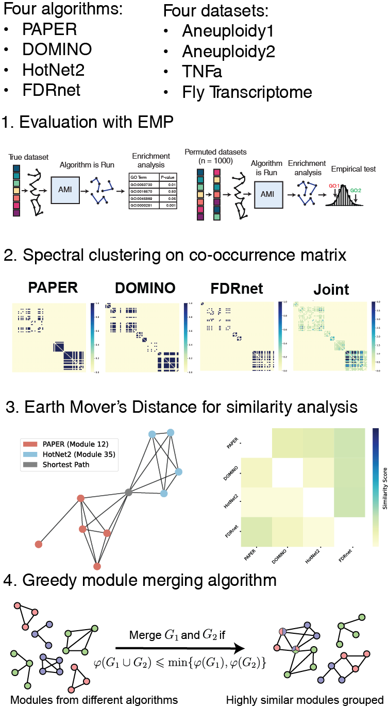

# Evaluation and Aggregation of Active Module Identification Algorithms
This repository contains the files used in the study "Evaluation and Aggregation of Active Module Identification Algorithms."
## Project Workflow

## EMP
### Algorithms
We provide the code we used to run EMP for the various algorithms. 
First, you will need to set up each algorithm according to its instructions following these links: 
- [PAPER](https://github.com/nineisprime/PAPER)
- [HotNet2](https://github.com/raphael-group/hotnet2)
- [FDRnet](https://github.com/yangle293/FDRnet)

You will also need to set up EMP according to [its repository](https://github.com/Shamir-Lab/EMP). We refer to its directory as `$EMP_dir`. 
Then, add the code in `emp/runners` to the `$EMP_dir/src/runners` directory in EMP. 

Since HotNet2 is written for Python2, you will need to set up a proper virtual environment for it and change the code in `$EMP_dir/src/runners/hotnet2_runner.py` accordingly. 
### Fly Transcriptome
Some changes are needed in order to run EMP for the Fly Transcriptome dataset. If you decide to run this dataset, please do 
```sh
sed -i 's/9606/7227/g' $EMP_dir/src/utils/go.py
```
to modify the GO enrichment study code. Then, replace `$EMP_dir/src/utils/ensembl2entrez.py` with the code in `emp/utils/ensembl2entrez.py`. 
## Set up
To run this code, you should run EMP or your algorithms and organize them according to the instructions in [EMP Benchmark](https://github.com/Shamir-Lab/EMP-benchmark?tab=readme-ov-file#set-your-directory-structure). The `i`-th module of algorithm `algo` and dataset `dataset` should be placed into:
```
{dataset}_{algo}/report/{algo}_module_genes_{i}.txt
```
(If you decide to run EMP, your modules will automatically be formatted in this way.)

This code was tested with Python 3.10.12. We recommend using a virtual environment and installing the dependencies with 
```sh
pip install -r requirements.txt
```

## Overview
Code used in the study is provided as follows. For details on how to use it for yourself, please check the in-code documentation. 
- `earth_movers.py`: code for computing Earth Mover's Distance (EMD). Use `emd_subgraph_similarity()`. 
- `group_modules.py`: code for spectral aggregation, used in section 2.4.2. Use `perform_clustering()`.
- `merge_modules.py`: an implementation of the merging algorithm (Algorithm 1), described in section 2.4.3. Use `merge_by_conductance()`.
- `solution_similarity.py`: code to generate algorithm similarity scores and heatmaps (Figure 6). Use `create_combined_heatmap()` for the visualization. Use `compute_solution_similarity()` and `compute_similarity_non_matching()` for the matching and sum similarity algorithms, respectively. 
- `visualize_module_distribution.py`: generates a distribution of module sizes summed across datasets (Figure 3). Use `visualize_module_sizes()`. 
- `visualize_modules.py`: code to find and generate pairs of similar modules (Figure 5). To find similar modules, use `find_conserved_modules()`. To visualize them, use `visualize_conserved_modules()`. 